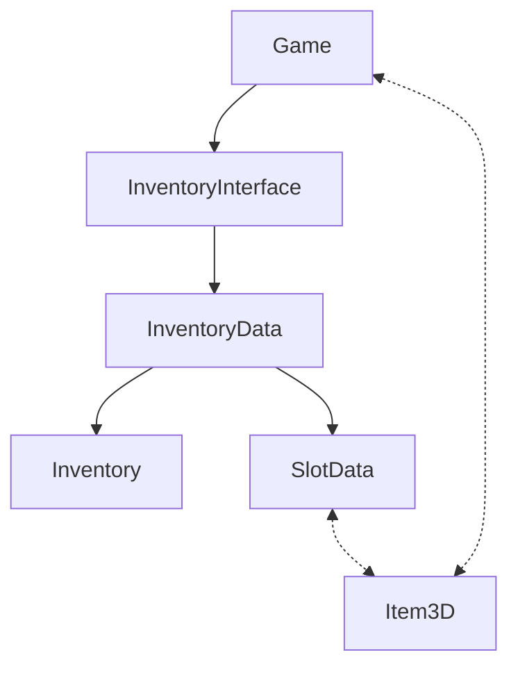

# Item System
**ItemInformation** defines the details of an item for the purposes of the inventory system. **InventoryData** is the canonical representation of an inventory and contains **SlotData** and **EquipmentSlotData** objects, which in turn represent individual instance information about an object. An **Item3D** is the 3D representation of a **SlotData**. The system is semi recursive since a **SlotData** can also contain an **InventoryData**. 

And **Inventory** is the control that displays the contents of an **InventoryData** resource and the **InventoryInterface** is attached to the player and displays all the various Inventories that the player might interact with

## Class Diagram

## Adding an Item
1. Create Model/Mesh
    1. See [this doc](./blender.md) for more information
2. Create Inventory Icons
    1. See Future UI/UX guide for style and approach tips  
3. Create new folder for item
    1. Somehwere in the game_objects/items/ folder is a good place to start
4. Create a new ItemInformation resource in the folder
    1. Some of the fields you won't be able to fill out till later, but fill in as much as possible.
    2. `item_type_id` is the unique string that represents this item and helps link the `ItemInformation` and `Item3D` classes. Fill it out and be descriptive
    3. Set `icon` and `icon_r` to the icons created previously
5. Create new RigidtBody3D or Item3D 3D scene in the folder
6. Attach the Item3D script to the root if it isn't already
    1. If the item you're creating has custom gameplay elements, extend Item3D with your custom game logic.
7. Add Model/Mesh to 3D scene.
8. Add Collider and set collider path in Item3D script

### Getting Item to show in game
#### Quick and dirty
Drag the Item3D scene into the scene you want the item to show up in. In `_ready` function of Item3D it will check if it has `SlotData` and if it doesn't, it will instantiate one
#### Adding to spawn pool
1. Create a `LootSpawnInformation` resource for the item in its folder
2. Create a `LootSpawnWeight` resource in the appropriate biome folder OR directly in the biome `LootSpawnMapping`
    1. If creating resource file, be sure to add it to the mapping.
  
For more information about the spawning system, see the future spawn documentation
